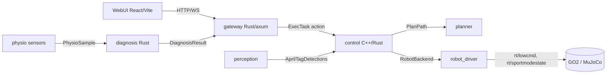

# ROS Subhealth

Medical-inspection robot control system for a Unitree GO2. Tasks are dispatched
through a web UI and an HTTP/WS gateway, planned over a tag graph, executed on
the robot, and augmented with LLM-driven physiological diagnosis.

This repository is mid-migration: the legacy Python/ROS 2 Foxy stack is being
replaced by a Rust-first stack on ROS 2 Jazzy / Ubuntu 24.04. See
[Migration status](#migration-status).

## Architecture



- **Language:** Rust-first. The only isolated exception is the Unitree hardware
  boundary, kept behind the `RobotBackend` trait so it can fall back to C++ if
  the Phase 0 DDS spike requires it.
- **Runtime:** ROS 2 Jazzy on Ubuntu 24.04, `rmw_cyclonedds_cpp`. The GO2 is
  coupled at the DDS layer, not to a ROS distro (see research doc).
- **Tooling:** all ROS/Rust tooling runs in Docker; nothing is installed on the
  host.

## Repository layout

```
services/gateway/     Rust HTTP/WS gateway (replaces desc_layer)
services/diagnosis/   Rust aggregation + anomaly + RAG + LLM core
services/orchestrator-core/  Rust task routing + device registry (pure logic)
services/device-sdk/  Rust adapter contract + mock / diff-drive / TonyPi backends
services/world-model/ Rust graph map loader + Dijkstra planner
services/safety/      Rust velocity limits, watchdog, emergency stop
services/perception-sim/  Rust geometry AprilTag detector
ros2_ws/src/robot/interfaces/     ROS 2 interfaces (no prefix)
ros2_ws/src/robot/adapter/        rclrs device adapter (mock / diff_drive / tonypi)
ros2_ws/src/robot/orchestrator/   rclrs orchestrator (discovery + routing)
ros2_ws/src/robot/gateway_bridge/ gateway HTTP/WS + ROS bridge
ros2_ws/src/robot/diagnosis_node/ diagnosis ROS node
ros2_ws/src/robot/physio_mock/    mock physiological sensors
ros2_ws/src/robot/perception_sim/ simulated AprilTag node
ros2_ws/src/robot/perception_camera/ real camera AprilTag (tag36h11) node
webui/                React + Vite UI (served by the gateway)
deploy/               debian, systemd, apt, rauc, config, spikes
docker/dev/           pinned Jazzy + Rust dev image
legacy/               retired Python / Foxy implementation (reference only)
docs/                 spec, plan, ADRs, RFCs, research
```

## Quickstart

Every routine task is wrapped in the root `Makefile`; run `make help` for the
full list.

### Rust services + gateway (no ROS needed)

```bash
make test          # cargo test --workspace
make gateway       # HTTP/WS gateway on :5000
curl localhost:5000/api/v1/tasks
```

### ROS interfaces + nodes (Jazzy dev container)

The ROS work (interfaces, rclrs nodes, and IDE analysis of `ros2_ws`) runs in
the pinned Jazzy dev container. With VS Code, install the *Dev Containers*
extension and choose **Reopen in Container**, then:

```bash
make ros
```

`make ros` builds the interfaces and nodes and writes
`ros2_ws/.cargo/config.toml`, which lets the `rust-analyzer` extension (running
in the container) resolve the node crates. Re-run it after editing any
`.msg`/`.action`/`.srv`.

Without VS Code, the same targets enter the container for you:

```bash
make image   # build the dev image once
make ros     # build interfaces + nodes
```

### WebUI and packaging

```bash
make webui       # pnpm install + build
make deb         # service .deb (cargo-deb)
make ros-deb     # ROS nodes + interfaces .deb
```

Full walkthrough: [`docs/guide/getting-started.md`](docs/guide/getting-started.md).

## Migration status

| Area | Status |
|---|---|
| Platform decision (Jazzy / external PC) | decided |
| Research on GO2 coupling and Rust ecosystem | done (`docs/tech/tech-platform-migration-research.md`) |
| Design spec | done (`docs/superpowers/specs/2026-09-13-rust-ros2-jazzy-rearchitecture-design.md`) |
| Rust gateway (RFC-005 contract) | implemented + tested |
| Rust diagnosis core | implemented + tested |
| Interface packages (Jazzy) | built and verified in container |
| Jazzy + Rust dev image | built |
| CI | added |
| Language boundary (Rust/C++/Python) | decided (`docs/tech/adr-001-language-scope.md`) |
| Device contract + single-task orchestration | decided (`docs/tech/adr-002-device-contract.md`) |
| Device interfaces (`device_interfaces`, `DeviceTask`) | built and verified in container |
| Orchestrator core (pure logic) | implemented + tested (`services/orchestrator-core`) |
| Device adapter SDK (mock + diff-drive sim) | implemented + tested (`services/device-sdk`) |
| rclrs adapter node (mock / diff_drive / tonypi, `DeviceTask` action) | builds in Jazzy container; mock + TonyPi paths verified end-to-end |
| rclrs orchestrator node (discovery + routing) | builds; mock and TonyPi vertical slices verified end-to-end |
| TonyPi backend (JSON-RPC `RunAction`) | implemented + tested (`services/device-sdk/src/tonypi.rs`) |
| World model + Dijkstra planner | implemented + tested (`services/world-model`) |
| Safety supervisor (limits/watchdog/estop) | implemented + tested (`services/safety`) |
| Physio mock + diagnosis ROS nodes | built; anomaly result verified end-to-end |
| Perception: simulated AprilTag detector + node | built; detection verified end-to-end |
| Gateway ↔ orchestrator bridge (`gateway_bridge`) | built; full HTTP → adapter → result verified |
| World-model planner wired into orchestrator | tag/waypoint → pose resolution verified (`diff_drive`) |
| Real camera AprilTag (tag36h11) | built; detection verified with a generated marker |
| Debian package (`ros-subhealth-nodes`) | built; nodes start from the packaged prefix |
| GO2 DDS spike (optional, deferred) | runbook ready (`deploy/spikes/go2_lowcmd_probe.md`) |
| Hardware validation | runbooks ready: `deploy/spikes/{tonypi,perception_camera}_*.md` |
| Retired legacy Python packages | moved to `legacy/` (out of the build tree) |

## Documentation

- Current architecture (authoritative): `docs/tech/tech-current-architecture.md`
- Language scope: `docs/tech/adr-001-language-scope.md`
- Device contract: `docs/tech/adr-002-device-contract.md`
- Design spec: `docs/superpowers/specs/2026-09-13-rust-ros2-jazzy-rearchitecture-design.md`
- Implementation plan: `docs/superpowers/plans/2026-09-13-rust-ros2-jazzy-rearchitecture.md`
- Platform research: `docs/tech/tech-platform-migration-research.md`
- TonyPi recon: `deploy/spikes/tonypi_interface.md`
- RFCs: `docs/rfc/` (older RFCs carry a "superseded" banner)
