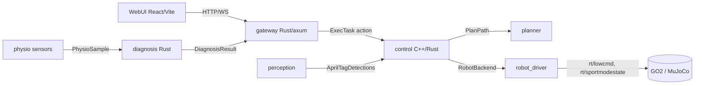

# ROS Subhealth

Medical-inspection robot control system for a Unitree GO2. Tasks are dispatched
through a web UI and an HTTP/WS gateway, planned over a tag graph, executed on
the robot, and augmented with LLM-driven physiological diagnosis.

This repository is mid-migration: the legacy Python/ROS 2 Foxy stack is being
replaced by a Rust-first stack on ROS 2 Jazzy / Ubuntu 24.04. See
[Migration status](#migration-status).

## Architecture



- **Language:** Rust-first. The only isolated exception is the Unitree hardware
  boundary, kept behind the `RobotBackend` trait so it can fall back to C++ if
  the Phase 0 DDS spike requires it.
- **Runtime:** ROS 2 Jazzy on Ubuntu 24.04, `rmw_cyclonedds_cpp`. The GO2 is
  coupled at the DDS layer, not to a ROS distro (see research doc).
- **Tooling:** all ROS/Rust tooling runs in Docker; nothing is installed on the
  host.

## Repository layout

```
services/gateway/     Rust HTTP/WS gateway (replaces desc_layer)
services/diagnosis/   Rust aggregation + anomaly + RAG + LLM core
services/orchestrator-core/  Rust task routing + device registry (pure logic)
services/device-sdk/  Rust adapter contract + mock / differential-drive backends
ros2_ws/src/robot/interfaces/  ROS 2 interfaces (no prefix)
ros2_ws/src/robot/    ROS nodes + adapters (added per milestone)
webui/                React + Vite UI (served by the gateway)
deploy/               debian, systemd, apt, rauc, config, spikes
docker/dev/           pinned Jazzy + Rust dev image
docs/                 spec, plan, ADRs, RFCs, research
```

## Quickstart

### Gateway (Rust, no ROS needed)

```bash
cargo test --workspace
GATEWAY_DB_DIR=/tmp/ros GATEWAY_MAPS_DIR=ros2_ws/config/maps cargo run -p gateway
curl localhost:5000/api/v1/tasks
```

### ROS interfaces on Jazzy (Docker)

```bash
docker build -t ros-dev:jazzy docker/dev
docker run --rm -v "$PWD":/workspace -w /workspace ros-dev:jazzy \
  bash docker/dev/build_ros_rust.sh
```

## Migration status

| Area | Status |
|---|---|
| Platform decision (Jazzy / external PC) | decided |
| Research on GO2 coupling and Rust ecosystem | done (`docs/tech/tech-platform-migration-research.md`) |
| Design spec | done (`docs/superpowers/specs/2026-09-13-rust-ros2-jazzy-rearchitecture-design.md`) |
| Rust gateway (RFC-005 contract) | implemented + tested |
| Rust diagnosis core | implemented + tested |
| Interface packages (Jazzy) | built and verified in container |
| Jazzy + Rust dev image | built |
| CI | added |
| Language boundary (Rust/C++/Python) | decided (`docs/tech/adr-001-language-scope.md`) |
| Device contract + single-task orchestration | decided (`docs/tech/adr-002-device-contract.md`) |
| Device interfaces (`device_interfaces`, `DeviceTask`) | built and verified in container |
| Orchestrator core (pure logic) | implemented + tested (`services/orchestrator-core`) |
| Device adapter SDK (mock + diff-drive sim) | implemented + tested (`services/device-sdk`) |
| rclrs adapter node (mock / diff-drive, `DeviceTask` action) | builds in Jazzy container (`docker/dev/build_ros_rust.sh`) |
| TonyPi interface recon | done (`deploy/spikes/tonypi_interface.md`) |
| GO2 DDS spike (optional, deferred) | runbook ready (`deploy/spikes/go2_lowcmd_probe.md`) |
| rclrs orchestrator node (action client / routing) | next (M3b) |
| TonyPi adapter | next (M4), depends on M3b |
| Deployment (deb/apt/systemd/RAUC) | scaffolded |
| Retire legacy Python packages | pending M5 |

## Documentation

- Language scope: `docs/tech/adr-001-language-scope.md`
- Device contract: `docs/tech/adr-002-device-contract.md`
- Design spec: `docs/superpowers/specs/2026-09-13-rust-ros2-jazzy-rearchitecture-design.md`
- Implementation plan: `docs/superpowers/plans/2026-09-13-rust-ros2-jazzy-rearchitecture.md`
- Platform research: `docs/tech/tech-platform-migration-research.md`
- TonyPi recon: `deploy/spikes/tonypi_interface.md`
- RFCs: `docs/rfc/`
