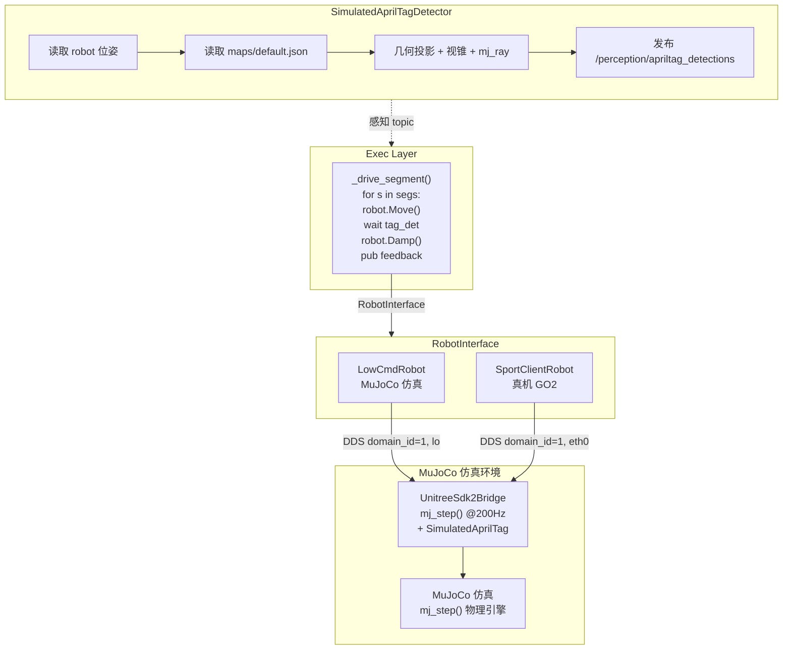
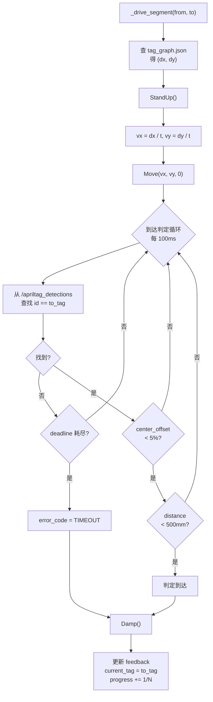
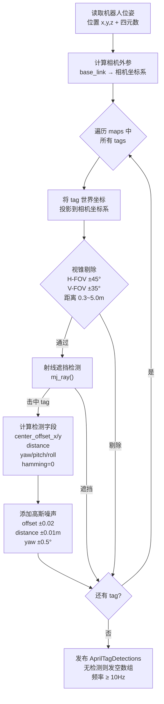

## RFC 008: 执行层机器人控制与仿真对接

**状态：** 草案

**修订日期：** 2026-07-21

**修订历史：**
| 日期 | 变更 |
|---|---|
| 2026-07-21 | 初版 |
| 2026-07-21 | 补充 RobotInterface 抽象层、几何 AprilTag 仿真、DDS 对齐方案 |

---

## 1. 摘要

当前 exec_layer 的 `_drive_segment()` 是空桩，无法驱动机器人运动；无模拟环境，全链路验证依赖真实机器人。本 RFC 定义 exec_layer 通过 RobotInterface 抽象层控制机器人，仿真环境下使用 LowCmdRobot 驱动 MuJoCo，真机环境下使用 SportClientRobot 调用 GO2。同时定义仿真内几何 AprilTag 检测方案，无需渲染即可完成 segment 到达闭环。

---

## 2. 目标与非目标

**目标：**
1. 实现 `_drive_segment(from_tag, to_tag)` 的真实运动逻辑：RobotInterface.Move + AprilTag 反馈闭环。
2. 定义 RobotInterface 抽象层，分 LowCmdRobot（MuJoCo 仿真）与 SportClientRobot（真机 GO2）两种实现。
3. 仿真环境下实现几何 AprilTag 检测（方案 A），无需渲染画面即可发布 `/perception/apriltag_detections`。
4. 统一 DDS domain/interface 配置，使 ROS2 节点与 MuJoCo bridge 互通。
5. 真机模式下 SportClient 调用失败时 exec_layer 上报对应 error_code 并终止任务。

**非目标：**
1. 不定义 Tag Graph 的数据格式与编辑方式（见 RFC 007）。
2. 不定义 AprilTag 感知发布协议（见 RFC 001）。
3. 不实现真实 AprilTag 图像渲染与检测（方案 B 为后续迭代，见 §10）。
4. 不替换 mock_exec_layer（三者共存，mock 用于纯 WebUI 验证）。
5. 不实现底层电机直接控制与姿态调整动作组（见 RFC 002）。

---

## 3. 现状与痛点

1. `exec_layer/_drive_segment()` 仅为日志空桩，无法连接机器人硬件，WebUI 看不到真实运动。
2. 无模拟环境，每次验证需要启动真机 GO2，迭代效率低、存在安全风险。
3. exec_layer 不消费 `/perception/apriltag_detections` topic，无法利用感知反馈做到达判定。
4. 仿真与真机的控制代码分离，维护两套实现成本高。

---

## 4. 方案概览

exec_layer 通过 `RobotInterface` 抽象层控制机器人，不直接调 SportClient。`_drive_segment()` 内循环执行：调用 `Move()` 发速度指令 → 订阅 `/apriltag_detections` 检查目标 tag 是否到达 → 到达后 `Damp()` 停止 → 更新 feedback。

两种实现注入：

- **Simulation 模式** → `LowCmdRobot(self)`：自行计算步行 gait 参数，发布 `rt/lowcmd` 到 DDS。MuJoCo 的 `UnitreeSdk2Bridge` 消费后驱动仿真。同时 `SimulatedAprilTagDetector` 读取地图 JSON + 机器人位姿，几何投影计算 tag 检测结果并发布到 `/perception/apriltag_detections`。
- **Real Robot 模式** → `SportClientRobot(self)`：调 GO2 的 SportClient RPC。AprilTag 来自实机相机 + `apriltag_perception` 节点。



---

## 5. 关键接口

### 5.1 RobotInterface 抽象层

exec_layer 不直接调用 SportClient，通过抽象接口 `RobotInterface` 控制机器人：

```python
class RobotInterface(ABC):
    @abstractmethod
    def move(self, vx: float, vy: float, vyaw: float) -> None: ...
    @abstractmethod
    def stand_up(self) -> None: ...
    @abstractmethod
    def damp(self) -> None: ...
    @abstractmethod
    def recovery_stand(self) -> None: ...
```

| 调用 | 参数 | 说明 |
|---|---|---|
| `move(vx, vy, vyaw)` | float32 ×3 | 速度控制 (m/s, m/s, rad/s) |
| `stand_up()` | — | 从躺卧到站立 |
| `damp()` | — | 停止运动并进入阻尼模式 |
| `recovery_stand()` | — | 跌倒后恢复站立 |

exec_layer 通过 ROS2 参数 `robot_backend` 选择实现：

| `robot_backend` 值 | 实现类 | 目标 |
|---|---|---|
| `"mock"` | 无（退化为 stub） | 当前 mock_exec_layer |
| `"sim"` | `LowCmdRobot` | MuJoCo 仿真 |
| `"real"` | `SportClientRobot` | 真机 GO2 |

### 5.1a LowCmdRobot（仿真实现）

通过低阶 DDS 控制 MuJoCo 仿真机器人。初始化时建立 `ChannelPublisher("rt/lowcmd", LowCmd_)`。`move()` 内计算步行 gait 参数后发布到 `rt/lowcmd`。

| 方法 | 行为 |
|---|---|
| `init()` | `ChannelFactoryInitialize(domain_id, interface)`, 创建 `ChannelPublisher("rt/lowcmd", LowCmd_)` |
| `move(vx, vy, vyaw)` | 根据速度计算 trot gait 相位，以 ~200Hz 发布 LowCmd（参照 `walk_go2.py` 的 gait controller） |
| `stand_up()` | 发布过渡到站立姿态的 LowCmd 序列 |
| `damp()` | 将 kd 设为最大值，qd 设为 0，迅速停止；或直接退出 gait loop |
| `recovery_stand()` | 暂不实现，返回 NotImplementedError |

### 5.1b SportClientRobot（真机实现）

通过 unitree SportClient RPC 控制 GO2 实机。

| 方法 | 实际调用 |
|---|---|
| `init()` | `ChannelFactoryInitialize(domain_id, "eth0")`, `SportClient(SPORT_SERVICE_NAME).SetTimeout(3.0).Init()` |
| `move(vx, vy, vyaw)` | `SportClient.Move(vx, vy, vyaw)` |
| `stand_up()` | `SportClient.StandUp()` |
| `damp()` | `SportClient.Damp()` |
| `recovery_stand()` | `SportClient.RecoveryStand()` |

`ChannelFactoryInitialize` 的参数（domain_id, interface）通过 ROS2 参数传入 exec_layer。

### 5.2 ROS2 接口

| 类型 | 名称 | 消息 | 说明 |
|---|---|---|---|
| Action | `/exec_task` | `ExecTask.action` | 不变，WebUI → Desc → Exec 单一入口 |
| Topic | `/perception/apriltag_detections` | `AprilTagDetections.msg` | 订阅感知输出，用于到达判定 |
| Action | `/mock_exec_task` | `ExecTask.action` | Mock 模式用，不与 SportClient 冲突 |

### 5.3 模拟 / 真机切换

| 模式 | `robot_backend` | 机器人控制 | AprilTag 来源 | 启动方式 |
|---|---|---|---|---|
| Mock | `"mock"` | 无（空桩） | 内置定时器 | `ros2 run mock_exec_layer` |
| Simulation | `"sim"` | `LowCmdRobot` → MuJoCo DDS | `SimulatedAprilTagDetector` 几何投影 | 先 `unitree_mujoco.py`，再 exec_layer |
| Real Robot | `"real"` | `SportClientRobot` → GO2 RPC | 实机相机 + `apriltag_perception` | `ros2 run exec_layer` |

exec_layer 通过 ROS2 参数 `robot_backend`（默认 `"mock"`）选择模式，通过 `dds_domain_id`（默认 `1`）和 `dds_interface`（默认 `"lo"`）配置 DDS。

---

## 6. 数据/控制流

### 6.1 Segment 执行闭环



### 6.2 速度计算

`_drive_segment` 从 Tag Graph 获取 from→to 的 `(x, y)` 坐标差，换算为机器人坐标系下的速度指令：

```
dx = tags[to].x - tags[from].x
dy = tags[to].y - tags[from].y
estimate_t = sqrt(dx² + dy²) / default_speed
vx = dx / estimate_t
vy = dy / estimate_t
```

`default_speed` 从 goal 的 `constraints.max_speed_mps` 获取，未设置时默认 0.3 m/s。

### 6.3 MuJoCo 仿真 DDS 桥接

`unitree_mujoco/simulate_python/unitree_mujoco.py` 启动时执行：

```
ChannelFactoryInitialize(domain_id=1, interface="lo")
UnitreeSdk2Bridge(model, data)
  → 订阅 DDS topic "rt/lowcmd"
  → 将低阶控制指令映射到 MuJoCo 电机
  → 发布 DDS topic "rt/sportmodestate"（含位置/速度/IMU）
```

SportClient 的 `Move()` 内部向 `rt/sportmodestate` 等 topic 发布指令，向 `unitree_api` service 发送请求。MuJoCo bridge 消费这些指令后驱动仿真。

### 6.4 几何 AprilTag 仿真（SimulatedAprilTagDetector）

仿真环境下，`SimulatedAprilTagDetector` 节点不渲染画面，通过几何投影计算 tag 检测结果。



**输出格式**与 RFC 001 完全对齐，exec_layer 无需区分检测来自仿真还是真机。

### 6.5 DDS 域与接口对齐

| 组件 | DDS 实现 | Domain ID | Interface | ROS_LOCALHOST_ONLY |
|---|---|---|---|---|
| MuJoCo bridge | CycloneDDS | 1 | lo | N/A |
| exec_layer (sim 模式) | CycloneDDS | 1 | lo | N/A |
| exec_layer (real 模式) | CycloneDDS | 1 | eth0 或自动 | N/A |
| ROS2 其他节点 | rmw_cyclonedds_cpp | 1 | lo | 设 1 或无关 |

配置项：
- ROS2 端：`export RMW_IMPLEMENTATION=rmw_cyclonedds_cpp` + `export ROS_DOMAIN_ID=1`
- MuJoCo 端：`config.py` 中 `DOMAIN_ID=1, INTERFACE="lo"`
- exec_layer 端：通过 ROS2 参数 `dds_domain_id=1, dds_interface="lo"` 传给内部 DDS 初始化

**前提条件：** 编译 CycloneDDS RMW 插件（`~/unitree_ros2/cyclonedds_ws` 已有编译产物）。

### 6.6 错误码与异常处理

| 场景 | error_code | 行为 |
|---|---|---|
| SportClient 初始化失败 | `INTERNAL` | `goal_handle.abort()`，任务终止 |
| 目标 tag 在检测中持续缺失 | `UNREACHABLE` | 超时后终止，robot 原地 Damp |
| deadline_ms 耗尽 | `TIMEOUT` | 同 UNREACHABLE |
| 机器人跌倒（通过状态检测） | `INTERNAL` | 尝试 RecoveryStand，失败则终止 |
| cancel 请求 | — | 立即 Damp()，返回 canceled |

---

## 7. 风险与替代

1. **替代方案：** 用低阶 `LowCmd` 直接控制电机，而非高阶 SportClient。
   - **权衡：** 控制粒度更细可做平滑插值，但需要逆运动学与状态机，实现复杂度大幅增加。
2. **替代方案：** MuJoCo 仿真打包为 ROS2 `ament_python` 节点而非独立脚本。
   - **权衡：** 纳入 colcon 管理便于 launch 集成，但 MuJoCo 的 viewer 在主线程阻塞，与 rclpy spin 冲突。
3. **替代方案：** 仿真中渲染画面做真实 AprilTag 检测（方案 B）。
   - **权衡：** 端到端验证感知算法更彻底，但帧率降至 20-30fps，部署复杂。目前几何投影方案（方案 A）已满足到达判定需求。
4. **风险：** MuJoCo 仿真与真机的运动动力学存在差异，`Move()` 速度参数调优不能直接复用。
5. **风险：** AprilTag 发布频率低于 10Hz 时，segment 到达判定可能延迟，需加降级逻辑。
6. **风险：** LowCmdRobot 的 gait 控制器可能与真机行为不一致，导致仿真通过的参数在真机上不可用。两种模式的 RobotInterface 实现需要各自调优。

---

## 8. 验证计划

| 测试 | 方法 | 通过标准 |
|---|---|---|
| StandUp/Move/Damp 调用 | exec_layer 启动后手动调用 SportClient 方法 | 机器人（仿真或实机）执行对应动作 |
| 仿真 Segment 执行 | MuJoCo + exec_layer，下发 go_to_tag(42) | 机器人在仿真中朝 tag 移动 |
| AprilTag 闭环 | 仿真中 tag 置于机器人前方 | 机器人移动到 tag 前停止，current_tag 更新 |
| 超时终止 | deadline_ms 设为 1s，tag 不在视野 | error_code = TIMEOUT，任务 failed |
| Cancel | WS /cancel | 机器人立即暂停，state = canceled |
| Mock 兼容 | `use_sport_client=false` 执行 | 退化为当前 stub 行为 |

---

## 9. 未决问题

1. 仿真启动是否打包为 ROS2 `ament_python` 包，还是保持独立 Python 脚本 + 子进程启动。
2. `domain_id` 和 `interface` 参数通过 ROS2 参数还是环境变量传递给 unitree SDK。
3. 多 tag 同时出现在视野中时，exec_layer 如何选取当前应逼近的目标（按 `next_tag` 匹配还是最近 tag）。
4. 机器人跌倒检测通过 SportModeState 的 `error_code` 还是 IMU 数据判断。
5. LowCmdRobot 的 gait 控制器参数（步频、摆幅、kp/kd）默认值如何确定，是否需从 `walk_go2.py` 提取为配置文件。
6. SimulatedAprilTagDetector 的相机内参（FOV、分辨率）与真机 GO2 的相机参数是否对齐，否则仿真检测与真机检测的 `center_offset` / `distance` 存在系统偏差。

---

## 10. 后续操作

### 第一阶段：基础建设

| # | 任务 | 产出 | 参考 |
|---|---|---|---|
| P1 | 实现 `RobotInterface` 抽象基类 | `ros2_ws/src/orchestration/exec_layer/exec_layer/robot_interface.py` | §5.1 |
| P1 | 实现 `LowCmdRobot`（基础 gait） | `exec_layer/robot/low_cmd_robot.py` | `walk_go2.py` gait 参数 |
| P1 | exec_layer 按 `robot_backend` 参数注入对应实现 | `exec_layer_node.py` | §5.1 |
| P1 | 实现 `SimulatedAprilTagDetector` | 新包或集成在 `unitree_mujoco/bridge` 中 | §6.4 |
| P2 | 验证仿真全链路：MuJoCo + LowCmdRobot + SimulatedAprilTag | 机器人朝目标移动并停在 tag 前 | US-10 |

### 第二阶段：真机接入

| # | 任务 | 产出 | 参考 |
|---|---|---|---|
| P2 | 统一 DDS 为 CycloneDDS + domain_id=1 | 操作手册更新 + `setup_local.sh` | §6.5 |
| P2 | 实现 `SportClientRobot` | `exec_layer/robot/sport_client_robot.py` | §5.1b |
| P3 | GO2 实机验证 `go_to_tag` | 真机移动到目标点 | — |

### 第三阶段：增强

| # | 任务 | 周期 | 优先级 |
|---|---|---|---|
| P3 | 几何 AprilTag → 完整渲染检测（方案 B） | 后续迭代 | 低 |
| P3 | Map JSON → MuJoCo 场景 XML 转换 | 后续迭代 | 低 |
| P3 | `ros2 launch` 一键启动仿真全链路 | 后续迭代 | 低 |
