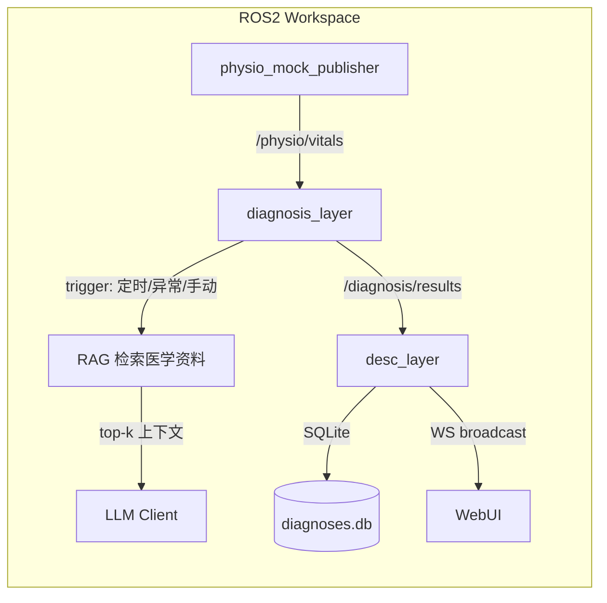

# RFC 009: 生理传感数据驱动的 LLM 健康诊断层

**状态：** 草案

**修订日期：** 2026-08-07

**作者：** 团队

**修订历史：**
| 日期 | 变更 |
|---|---|
| 2026-08-07 | 初版 |

---

## 1. 摘要
现有系统仅覆盖机器人任务编排与 AprilTag 感知，缺乏生理传感器（血氧/血压/心率等）的数据通道与自动诊断能力，传感器数据处于孤岛，异常依赖人工解读。本 RFC 新增一个 ROS2 诊断层 `diagnosis_layer`，订阅生理传感 topic，通过窗口聚合 + 规则异常检测 + RAG（医学资料检索）+ LLM 生成结构化健康建议，并经 desc_layer 持久化与推送，最终在 WebUI 展示。收益：mock 模式下全链路可测、诊断结果可追溯、可扩展更多传感源。影响面：新增 3 个 ROS2 包（physio_interfaces / physio_mock_publisher / diagnosis_layer）、扩展 desc_layer HTTP/WS API、新增 WebUI 诊断页面。

---

## 2. 目标与非目标
**目标：**
1. `./run.sh mock` 下全链路跑通：mock 生理 topic → 窗口聚合 → 触发 → RAG + LLM → 结构化诊断 → WS/WebUI 展示。
2. 支持三种触发：定时周期检查、异常阈值自动触发、WebUI/API 手动触发。
3. RAG 检索医学资料并注入 prompt，产出结构化 JSON（severity / possible_causes / recommendations / confidence / 免责声明）。
4. 诊断记录 SQLite 持久化，重启不丢失。

**非目标：**
1. 不做实时连续诊断，只做时间窗口聚合后的周期性诊断。
2. 不接入真实医疗设备协议，仅定义接口并提供 mock 数据源。
3. 不做医疗决策或医疗报警，仅输出健康建议级（advisory）内容。
4. 不做多设备/多用户管理与权限体系。

---

## 3. 现状与痛点
当前系统只有机器人任务状态（desc_layer 的 SQLite 任务记录）与 AprilTag 感知数据，没有任何生理/健康数据通道。`diagnosis_layer` 不存在，LLM 与 RAG 均未接入。具体痛点场景：生理传感器数据无处消费、异常无法自动发现、历史诊断无记录可回溯；若由人工阅读原始 topic 数据，低价值且易遗漏阈值越界。

---

## 4. 方案概览
一句话：在 ROS2 内部新增一个独立的诊断层，把生理传感数据聚合为结构化快照，再由 RAG + LLM 生成可追溯、可展示的健康建议，从而解决"数据孤岛 + 无自动诊断"的痛点。



数据/控制流概述：生理传感节点发布 `VitalsSample` → `diagnosis_layer` 订阅并维护滚动窗口 → 按触发条件（周期/异常/手动）构造快照 → 检索医学资料注入 prompt → 调用 LLM → 校验 JSON → 发布 `DiagnosisResult` → desc_layer 持久化并 WS 推送到 WebUI。

---

## 5. 关键接口

### 5.1 消息定义

**`physio_interfaces/msg/VitalsSample.msg`**（新增包 `physio_interfaces`）：

```text
# 单次生理采样
builtin_interfaces/Time timestamp
string source_id          # 传感器来源标识（如 device_spo2）
float32 spo2              # 血氧饱和度 %
float32 heart_rate        # 心率 bpm
float32 systolic_mmhg     # 收缩压
float32 diastolic_mmhg    # 舒张压
float32 body_temp_c       # 体温 ℃
float32 respiratory_rate  # 呼吸频率 次/分钟
bool spo2_valid
bool blood_pressure_valid
bool heart_rate_valid
```

**`ros_interfaces/msg/DiagnosisResult.msg`**（扩展 `ros_interfaces`）：

```text
builtin_interfaces/Time timestamp
string diagnosis_id
string source_id
string trigger_type       # periodic | anomaly | manual
string severity           # normal | mild | moderate | severe | critical
string summary
string[] possible_causes
string[] recommendations
float32 confidence
string disclaimer
string raw_prompt
string error_code
string error_message
```

### 5.2 Topic 一览

| Topic | 类型 | QoS | 频率 | 说明 |
|---|---|---|---|---|
| `/physio/vitals` | `physio_interfaces/VitalsSample` | RELIABLE, depth 10 | 1 Hz | 生理采样输入 |
| `/diagnosis/trigger` | `std_msgs/String` | RELIABLE, depth 10 | 事件驱动 | 手动触发（携带 trigger_type） |
| `/diagnosis/results` | `ros_interfaces/DiagnosisResult` | RELIABLE, depth 10 | 事件驱动 | 诊断结果输出 |

### 5.3 HTTP API（desc_layer，遵循 RFC-005 规范）

| 方法 | 路径 | 说明 |
|---|---|---|
| `POST` | `/api/v1/diagnostics` | 手动触发一次诊断 |
| `GET` | `/api/v1/diagnostics` | 诊断记录列表，支持分页 |
| `GET` | `/api/v1/diagnostics/{id}` | 单条诊断详情 |

### 5.4 WebSocket 事件

- `event: "diagnosis"`，载荷：`{ diagnosis_id, trigger_type, severity, summary, possible_causes, recommendations, confidence, timestamp, trace_id }`（其中 `trace_id` 与 `diagnosis_id` 相同，用于链路追踪）。

### 5.5 LLM 接口

- OpenAI-compatible `POST /v1/chat/completions`，`base_url` / `api_key` / `model` 通过 ROS2 参数或环境变量配置。
- Embedding：`POST /v1/embeddings`（同 provider）；不可用时回退关键词检索。

---

## 6. 数据/控制流
1. `physio_mock_publisher` 以 1 Hz 发布 `VitalsSample` 到 `/physio/vitals`。
2. `diagnosis_layer` 维护每个 `source_id` 的滚动窗口（默认 60 s），计算均值/最值/趋势。
3. 触发路径：
   - **定时**：`periodic_interval_s` 参数（默认 60 s）驱动周期检查。
   - **异常**：规则引擎（如 SpO2<90%、收缩压>140）即时触发。
   - **手动**：desc_layer 收到 `POST /api/v1/diagnostics` 后发布 `/diagnosis/trigger`。
4. 触发后构造结构化快照文本 → RAG 检索 top-k 医学资料 → 组装 prompt → 调用 LLM（异步，时延预算 2-10 s）。
5. 对 LLM 输出做 JSON 校验；失败时按 schema 重试（最多 3 次，含首次）。
6. 发布 `DiagnosisResult` 到 `/diagnosis/results`；desc_layer 订阅后写入 SQLite 并 WS 广播。
7. 失败退路：LLM 超时/不可用时，发布带 `error_code` 的诊断结果并保留原始快照，可重试。

---

## 7. 风险与替代
**风险：**
1. LLM 输出不稳定 → JSON schema 约束 + 校验重试（最多 3 次，含首次）。
2. embedding 端点不可用 → 关键词/规则检索回退。
3. 医学资料缺失 → 先无 RAG 跑通链路，`docs/medical/` 提供占位目录。

**替代：**
1. 直接在 desc_layer 内集成 LLM → 耦合 HTTP 与诊断逻辑，扩展性差；本方案独立成包。
2. WebUI 直连 topic → 无法跨网段；沿用 desc_layer 单一入口。

---

## 8. 验证计划
| 测试 | 通过标准 |
|---|---|
| 单元测试（聚合器） | 窗口统计正确，含边界与乱序时间戳 |
| 单元测试（异常检测） | 阈值越界触发、恢复后不重复触发 |
| 单元测试（快照/提示词） | 快照文本与 prompt 结构符合预期 |
| 单元测试（JSON 校验） | 合法/非法输出均正确处理 |
| 集成测试（mock） | `./run.sh mock` 下发布异常 vitals → 自动触发 → WS 收到 `diagnosis` |
| API 测试 | 鉴权、分页、统一错误格式、trace_id 贯穿 |

---

## 9. 未决问题
1. 医学参考资料由谁提供，格式是否统一为 Markdown。
2. embedding 复用诊断 LLM 的 provider，还是独立 embedding 模型。
3. 异常阈值是否需要多档位配置（如按年龄/场景）。
4. 诊断记录的保留时长与自动清理策略。
